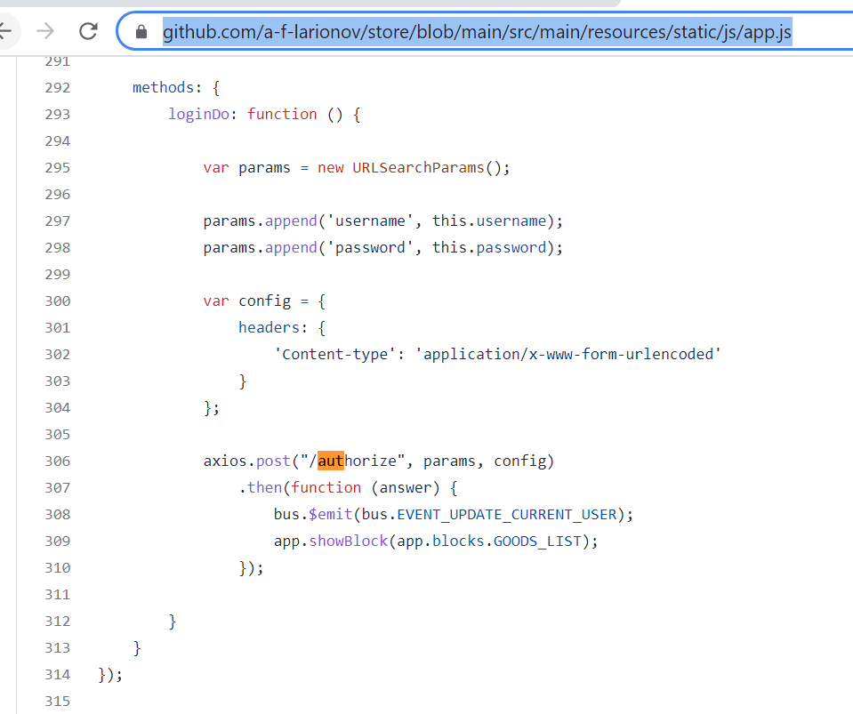

###Инструкция по SpringSecurity такая.

###1 - прописать в pom.xml зависимость
    <dependency>
    <groupId>org.springframework.boot</groupId>
    <artifactId>spring-boot-starter-security</artifactId>
    </dependency>
###2 - прописать зависимости, нужные для spring-boot-security:

    <dependency>
        <groupId>org.springframework.boot</groupId>
        <artifactId>spring-boot-starter-data-jpa</artifactId>
    </dependency>

    <dependency>
        <groupId>org.postgresql</groupId>
        <artifactId>postgresql</artifactId>
        <scope>runtime</scope>
    </dependency>

###3 - прописать spring security config

    https://github.com/a-f-larionov/store/blob/main/src/main/java/store/config/WebSecurityConfig.java

###4 - прописать сущности User Role и их репозитории
    https://github.com/a-f-larionov/store/blob/main/src/main/java/store/entities/Role.java
    https://github.com/a-f-larionov/store/blob/main/src/main/java/store/entities/User.java
    https://github.com/a-f-larionov/store/blob/main/src/main/java/store/repositories/RoleRepository.java
    https://github.com/a-f-larionov/store/blob/main/src/main/java/store/repositories/UserRepository.java

###5 - прописать User Service

    https://github.com/a-f-larionov/store/blob/main/src/main/java/store/services/UserService.java

###6 - пример регистрации

    https://github.com/a-f-larionov/store/blob/main/src/main/java/store/controllers/RegistrationController.java

авторизация производиться по
url
POST /authorize 
Content-type: application/x-www-form-urlencode

password=password username=username

